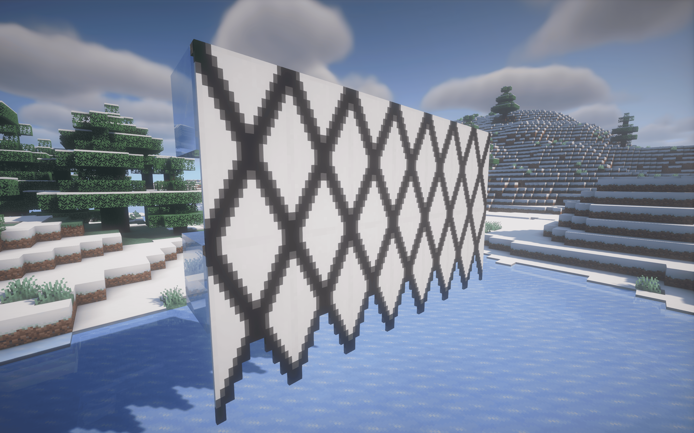

# Ensign

Banner things

## Features

- [Customisable banner rendering](#banner-rendering)
- [New banner shapes](#banner-shapes)
  - [Custom banner shapes](#custom-banner-shapes)

## Banner Rendering

If you have Mod Menu installed, Ensign allows you to customise how banners are rendered, turning animations off or making them larger. All rendering options are completely client-side.

## Banner Shapes

Ensign provides several new banner shapes:

To change the shape of a banner, craft/dye it as you normally would, and place
it and right click on it with a pair of shears. These banners behave exactly
like vanilla banners and can be dyed in a loom. They retain their shape upon
breaking.

 _From left
to right: regular, swallowtail, tongued swallowtail, rounded_

 _From left
to right: the Danish, Swedish, and Finnish naval ensigns_

## Custom Banner Shapes

Visit the [wiki page](https://github.com/diacritics-owo/ensign/wiki)
