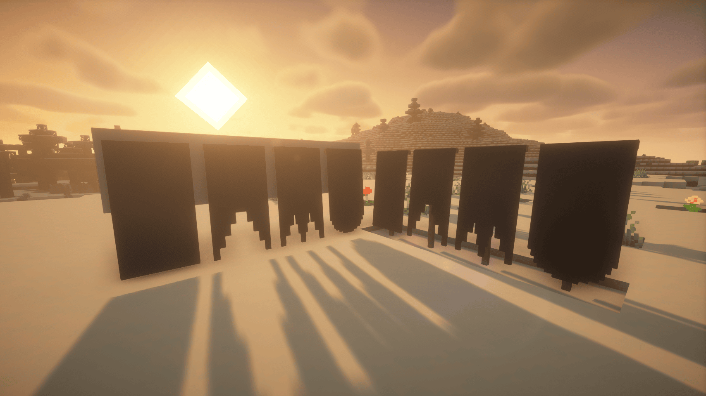

# Ensign

Banner things

## Usage

Ensign provides several new banner shapes:

 _From left
to right: regular, swallowtail, tongued swallowtail, rounded_

 _From left
to right: the Danish, Swedish, and Finnish naval ensigns_

To change the shape of a banner, craft/dye it as you normally would, and place
it and right click on it with a pair of shears. These banners behave exactly
like vanilla banners and can be dyed in a loom. They retain their shape upon
breaking.

